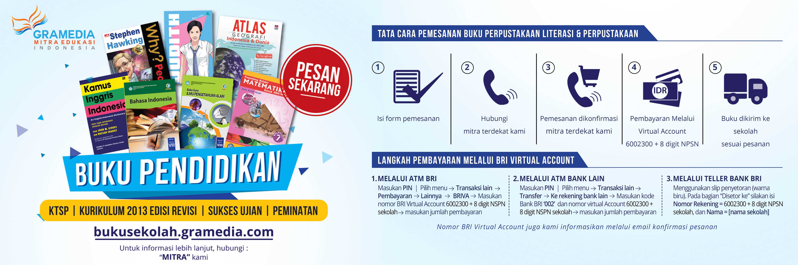

################################
Dokumentasi Website Buku Sekolah
################################

Ini adalah halaman dokumentasi seputar aplikasi Buku Sekolah Gramedia Printing. Tujuan dibuatnya dokumentasi ini untuk menjadi acuan minimal atau panduan dasar dalam pengelolaan dan pengembangan aplikasi ini.

Aplikasi ini dibangun menggunakan Framework PHP |link_ci|, lebih detil tentang framework ini dapat dilihat disini: |link_ci_doc|

.. |link_ci| raw:: html

   <a href="https://www.codeigniter.com/" target="_blank">CodeIgniter</a>

.. |link_ci_doc| raw:: html

   <a href="https://www.codeigniter.com/user_guide/" target="_blank">https://www.codeigniter.com/user_guide/</a>

Berikut ini daftar isi yang ada:

.. toctree::
	:maxdepth: 2

	requirements
	instalasi
	konfigurasi
	user_type
	pengelolaan
