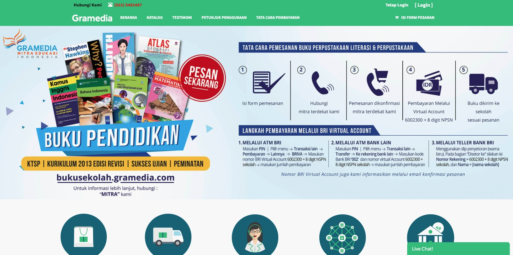
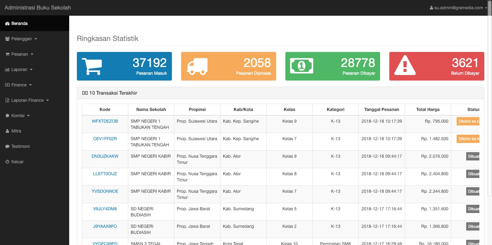
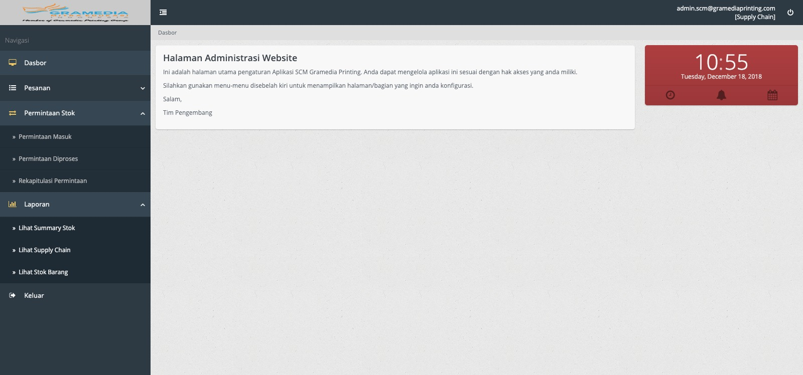

###########
Pengelolaan
###########

Aplikasi Buku Sekolah ini terdiri dari 3 (tiga) bagian utama, yang masing-masing memiliki fungsi yang berbeda-beda, seperti yang dijelaskan berikut ini:

Frontend
========

Bagian ini adalah halaman-halaman yang diakses oleh pelanggan/sekolah untuk melakukan:

* Pendaftaran
* Login
* Pemesanan buku
* Melihat katalog buku
* Melihat status pemesanan
* Melakukan testimoni
* Informasi kontak
* Melihat petunjuk penggunaan
* Melihat tata cara pembayaran

/backoffice
===========

Bagian ini adalah halaman-halaman yang diakses oleh pengguna internal (selain tim supply chain), fitur yang ada diantaranya adalah:

* Informasi pelanggan/sekolah
* Pengelolaan pesanan
* Laporan
* Finance
* Komisi
* Pengelolaan Mitra
* Pengelolaan Testimoni

/backmin
========

Bagian ini adalah halaman-halaman yang diakses oleh pengguna internal (tim supply chain), fitur yang ada diantaranya adalah:

* Pengelolaan pesanan
* Permintaan stok
* Laporan
